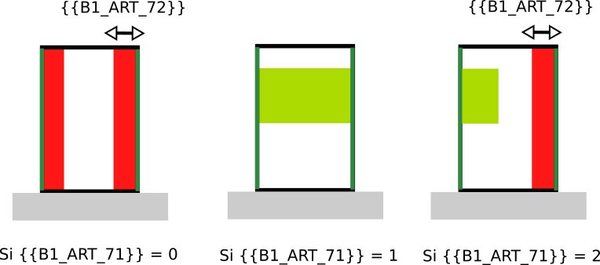

# IAUIDF-002 - Distance et alignement par rapport aux limites séparatives

## Modèle de phrase

> Une distance par rapport aux limites séparatives latérales de la parcelle de {{B1_ART_72}} m doit être respectée.
> Un alignement est imposé par rapport aux côtés des limites séparatives  {{B1_ART_71}}

## Paramètres

### B1_ART_71

Implantation en limite séparatives :

* 0 : Non, aucun retrait imposé par rapport au limites séparatives.
* 1 : Oui retrait imposé par rapport aux limites séparatives.
* 2 : Oui, retrait imposé mais uniquement sur un côté.

### B1_ART_72

Distance minimale des constructions par rapport aux limites séparatives imposée.

* Valeur numérique si B1_ART_71 est 1 ou 2.
* Pas de valeur sinon (-88 ou -99).

## Explications

*Le paragraphe ci dessous fait référence à une ancienne version et sera prochainement modifié*

Suivant les cas imposés par {{B1_ART_71}} :
* si {{B1_ART_71}} = 0, on ne peut construire à moins de {{B1_ART_72}} m des limites latérales ;
* si {{B1_ART_71}} = 1, le bâtiment doit être construit des deux côtés de la parcelle ;
* si {{B1_ART_71}} = 2, le bâtiment doit être collé d'un côté de la parcelle et respecter un recul par rapport à l'autre côté.

## Implémentation

La vérification de la distance s'effectue dans la classe PredicateIAUIDF. Dans le cas où le bâtiment doit être collé des deux côté ({{B1_ART_71}} = 1), pour l'instant il ne subit aucune contrainte et est libre en termes de placement. Si le bâtiment doit être d'un côté ({{B1_ART_71}} = 2), deux simulations sont effectuées en tentant de coller le bâtiment à chacun des côté de la parcelle et la simulation optimisant le volume est conservée. Le fait d'être collé est assuré lors de la génération du bâtiment (MultipleBuildingsCuboid).
